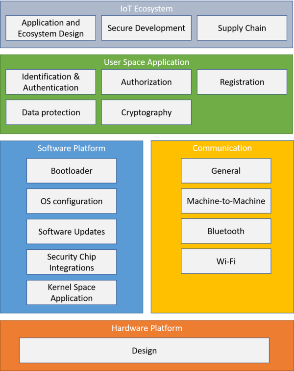

# Using the ISVS

The OWASP Internet of Things Security Verification Standard (ISVS) aims to establish levels of confidence in the security of IoT applications by providing requirements and best practices for connected devices.

IoT applications are often composed of many interconnected applications that together form a complex ecosystem. Securing an IoT application thus boils down to securing the ecosystem. The ISVS, therefore, specifies security requirements for embedded applications and the IoT ecosystem in which these reside while referring to existing industry-accepted standards as much as possible.

## The ISVS security model

The security control requirements provided by the ISVS can be represented as a stack. At the bottom, requirements for the hardware platform ([V5](V5-Hardware_Platform_Requirements.md)) are provided. Throughout the ISVS, the hardware platform is regarded as the different hardware components that make up the foundations for your connected device. On top of the hardware platform are the Software Platform ([V3](V3-Software_Platform_Requirements.md)) and the Communication ([V4](V4-Communication_Requirements.md)) requirements that make use of the hardware platform to enable rich application development. Requirements for these applications are provided in the user space applications requirements layer ([V2](V2-User_Space_Application_Requirements.md)). Finally, the IoT Ecosystem chapter provides a series of requirements that form the glue between the connected device and the surrounding ecosystem ([V1](V1-IoT_Ecosystem_Requirements.md)).  

## Security Verification Levels
The ISVS describes three security verification levels, with each level increasing in depth. Each level contains a set of requirements mapped to security-sensitive capabilities and features.

### ISVS Level 1
The goal of level one requirements is to provide protection against attacks that target software only, i.e. attacks that do not involve physical access to the device. Level one requirements aim to provide a security baseline for connected devices where physical compromise of the device does not result in high security impact. These are devices where the device's IP should not be protected, where no sensitive information is being stored on the device, and where compromise of one device does not allow an attacker to move laterally to other devices or systems on the IoT ecosystem.

An example of a level one device is a smart light bulb created with off the shelf hardware and software components. Compromise of the light bulb would not result in an attacker gaining access to state-of-the art technology. If no personal data is stored on the device, there is no data to be stolen. If authentication and authorization are correctly implemented on the supporting cloud infrastructure, the worst thing the attacker could do is spoof the status of the compromised light bulb.

### ISVS Level 2
The goal of level two requirements is to provide protection against attacks that go beyond software and that target the hardware of the device. Devices that adhere to level two requirements are devices where compromise of the device should be avoided. These are devices where the device's IP should be protected to a reasonable extent and where there is some form of sensitive information stored on the device.

Examples of level two devices are smart locks, alarm systems, smart cameras, and medical devices that aggregate measurement data and send it to a physician for analysis.

### ISVS Level 3
The goal of level three requirements is to provide requirements for devices where compromise should be avoided at all cost. Devices where there is highly sensitive information stored on the device or where compromise of the device can result in fraud. In addition to the security requirements provided by level one and two, level three requirements focus on defense-in-depth techniques that attempt to hinder reverse engineering and physical tampering efforts.

Examples of level three devices consist of hardware crypto wallets, smart-meters, connected vehicles, medical implants, recycle machines that trade aluminium cans for money.

## Recommended Use
IoT applications can differ a lot from one another. Some applications make use of sensors and hubs, some don't have sensors. Some run embedded Linux, some do not. While the ISVS aims to structure and define requirements in a way that's applicable as widely as possible, not all of the requirements in the ISVS may apply to your specific device. We strongly encourage tailoring ISVS to your use case and focus on high impact requirements that are most important to your environment. This may require a risk assessment to understand the desired level of security required.

Even though the standard is called a verification standard, its use goes much wider than providing requirements for verifying the overall security posture of connected devices. The fact that requirements are written from a verification perspective ensures that each requirement is measurable and achievable in practice. As a result, requirements can be used at different stages in a connected device's development process. Some example use cases are presented below.

- During the design of the supporting hardware platform, the hardware platform requirements in [V5](V5-Hardware_Platform_Requirements.md) are created so that they can be used to validate that the hardware platform provides all of the functionality that is required to implement the security requirements described in the other requirement category chapters.

- The requirements listed in the ISVS can be used during the requirement elicitation phase of the project.

- The requirements can be used to assess the overall security posture of a device's environment. It can help to define test cases, or it can be used by security professionals to assess the device's implementation.

## Document Structure
The subsequent chapters of this standard provide an overview of the different requirement categories described above. Each requirement category has a dedicated chapter in which the requirements are listed together with references to relevant standards. Definitions of the different words used throughout the standard are provided in [Appendix A - Glossary](Appendix_A-Glossary.md)
